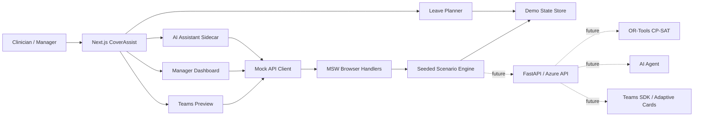
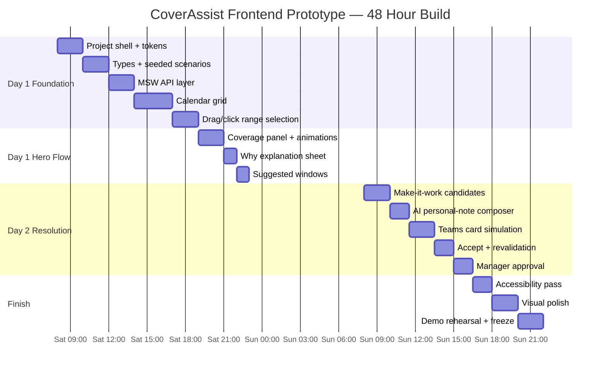

# CoverAssist Front-End Prototype Guide for a 48-Hour Hackathon

## Executive summary

The fastest credible prototype is a **frontend-only simulation of a future production system**, not a half-built backend. Build one polished Next.js application that contains the clinician leave planner, simulated workforce-impact engine, AI assistant, Teams cover workflow, and manager approval experience. All “backend” calls should go through real-looking HTTP contracts intercepted in the browser by **Mock Service Worker**, so engineers can later replace the mocks with FastAPI/Azure services without rewriting UI components. MSW is explicitly designed to intercept browser HTTP requests and return reusable mock responses, including for live demos, which makes it unusually well suited to this prototype. citeturn11view0

The prototype should demonstrate one continuous story:

> **Prevent → Explain → Resolve → Coordinate → Revalidate → Approve**

The hero interaction is the clinician selecting **18–20 November 2026**. Coverage visibly drops, **18 November becomes the blocking day**, and CoverAssist explains that the synthetic General Medicine rule requires two senior clinicians but only one would remain. The user says “Make it work”; Sarah Lee is recommended as the lowest-impact cover. The requester adds a personal note with AI-assisted phrasing; a simulated Teams Adaptive Card is sent; Sarah accepts; CoverAssist “revalidates” the roster; feasibility animates from **31 → 94**; the manager approves.

Do **not** present the 31/94 number as an approval probability. Call it **Leave Feasibility** or **Coverage Feasibility**. The future solver architecture can legitimately be described as compatible with an OR-Tools CP-SAT workforce engine: Google’s official employee-scheduling examples model assignment variables under hard constraints such as exactly one nurse per shift and at most one shift per nurse per day, and can optimize an objective such as fulfilled shift requests. citeturn7view0turn7view3turn7view1

For Microsoft positioning, the prototype can honestly be described as **“designed for Microsoft Teams and Azure integration”** rather than claiming it already has a live enterprise integration. Teams tabs are web pages embedded in Teams, support personal-app scenarios, receive Teams context, can deep-link to specific items, and can use Microsoft Entra-aware identity/SSO patterns when implemented for real. citeturn1search0turn1search1

**48-hour priority order:**

| Priority | Deliverable | Demo value |
|---|---|---|
| P0 | Monthly feasibility planner | Very high |
| P0 | Date-range selection + live staffing impact | Very high |
| P0 | Exact “Why?” explanation | Very high |
| P0 | “Make it work” cover recommendations | Very high |
| P0 | Sarah accepts → 31 to 94 revalidation | Very high |
| P1 | AI sidecar + personal-note composer | High |
| P1 | Teams Adaptive Card simulation | High |
| P1 | Manager approval screen | High |
| P2 | Leave Scout / proactive opportunity card | Medium-high |
| P2 | James creates downstream rest conflict | Medium-high |
| P3 | Real Teams tenant deployment | Only if easy |
| P3 | Real Azure deployment | Useful, not worth blocking UI |

## Prototype architecture and stack

Use **Next.js + React + TypeScript** as the shell, Tailwind for fast styling, shadcn/ui primitives for dialogs/sheets/buttons/tooltips, Motion for React for animation, and MSW for API simulation. Next.js’ current App Router is the actively documented application model; shadcn/ui exposes editable application-owned component code rather than forcing a rigid packaged design system; and Tailwind provides the grid, spacing, sizing, typography, borders and effects needed to iterate quickly. citeturn10view1turn10view0turn10view2

Motion for React supports state-driven `animate` props, springs, keyframes, hover/focus/drag states, variants and `AnimatePresence`; that maps directly onto feasibility-bar changes, modal transitions and suggested-window highlighting. citeturn3view0turn3view1



The important architectural trick is that **components should never import seed data directly**. They call the mock API exactly as they would call the eventual backend:

```ts
const result = await api.evaluateLeave({
  clinicianId: "clin-001",
  startDate: "2026-11-18",
  endDate: "2026-11-20",
});
```

MSW intercepts:

```text
POST /api/leave/evaluate
```

and returns the deterministic demo response. MSW’s network-level interception lets the UI continue to use ordinary `fetch()` instead of a demo-specific data path. citeturn11view0

### Recommended component stack

| Need | Recommendation | Why for 48 hours |
|---|---|---|
| Application | Next.js / React / TypeScript | One project; clean routing; easy future deployment |
| Styling | Tailwind CSS | Fast iteration and responsive layout |
| UI primitives | shadcn/ui | Dialog, Sheet, Button, Tabs, Tooltip, Textarea, Badge, Progress |
| Animation | Motion for React | State transitions, spring bars, pulse, modal presence |
| Icons | Lucide | Fits shadcn conventions; minimal visual overhead |
| Mock APIs | MSW | Real HTTP-shaped contracts without backend |
| State | React Context + reducer, or small Zustand store | Avoid complex state architecture |
| Calendar | Custom CSS Grid | We need a decision surface, not a generic event calendar |
| Charts | Avoid unless needed | Coverage bars can be ordinary animated `<div>` elements |
| Date utility | date-fns | Range and display formatting |
| Teams preview | Normal React route rendering card data | No tenant dependency |
| Production design cue | Fluent-inspired tokens | Makes Microsoft fit visually credible |

Microsoft’s Fluent 2 system defines reusable color, spacing, sizing, corner-radius and related design tokens, and Teams itself uses Fluent 2, so designers can borrow the visual language without introducing Fluent React as a second component library during the hackathon. citeturn12search0

**Recommended repository structure:**

```text
src/
├── app/
│   ├── page.tsx
│   ├── planner/page.tsx
│   ├── manager/page.tsx
│   ├── teams-preview/page.tsx
│   └── demo/page.tsx
│
├── components/
│   ├── calendar/
│   │   ├── LeaveCalendar.tsx
│   │   ├── LeaveDayCell.tsx
│   │   ├── LeaveRangeOverlay.tsx
│   │   └── SuggestedWindow.tsx
│   ├── coverage/
│   │   ├── CoveragePanel.tsx
│   │   ├── CoverageBar.tsx
│   │   └── ConstraintRow.tsx
│   ├── cover/
│   │   ├── CoverOptions.tsx
│   │   ├── CoverCandidateCard.tsx
│   │   └── PersonalNoteComposer.tsx
│   ├── agent/
│   │   ├── AgentPanel.tsx
│   │   └── AgentActivity.tsx
│   ├── teams/
│   │   └── TeamsCoverCardPreview.tsx
│   └── manager/
│       └── ApprovalPanel.tsx
│
├── lib/
│   ├── api.ts
│   ├── types.ts
│   ├── demo-state.ts
│   └── teams.ts
│
├── mocks/
│   ├── browser.ts
│   ├── handlers.ts
│   ├── scenarios.ts
│   └── seeds.ts
│
└── styles/
    └── tokens.css
```

## Required screens and interaction specification

Do **not** build ten disconnected pages. Use three principal screens and let drawers/modals carry the secondary workflows.

### Screen and component map

| Screen / surface | Required components | Must demonstrate |
|---|---|---|
| **Clinician Leave Planner** | Header, Leave Scout card, monthly grid, coverage panel, feasibility score, agent sidecar | Explore before applying |
| **Cover Resolution Flow** | Explanation sheet, ranked candidates, “Make this work”, note composer, send state | Explain + resolve |
| **Manager Dashboard** | Request summary, before/after feasibility, rule checklist, audit timeline, Approve | Human-in-loop |
| **Teams Preview** | Adaptive Card mock, Sarah persona, Accept/Decline/Ask question | Microsoft workflow |
| Optional demo console | Scenario picker, reset button, Teams unavailable toggle | Demo reliability |

The visual calendar should not be a conventional calendar filled with events. It is a **decision map**.

A cell should communicate four things without needing hover:

```text
┌─────────────────────┐
│ 18                  │
│                     │
│ 31                  │
│ Difficult           │
│ ⚠ Senior cover      │
└─────────────────────┘
```

Color reinforces status, but text/iconography conveys the same meaning because WCAG explicitly says color must not be the only means of conveying information. citeturn10view7

Use four states:

| State | Score | Cell label | Semantic cue |
|---|---:|---|---|
| Easy | 80–100 | `Easy` | ✓ |
| Good | 60–79 | `Good` | ✓ |
| Cover needed | 40–59 | `Cover needed` | ◐ |
| Difficult | 0–39 | `Difficult` | ⚠ |

### Drag-to-select behaviour

Use pointer events, not HTML5 drag/drop.

**Desktop interaction:**

1. Pointer down on 18 November.
2. Cell becomes range anchor.
3. Pointer enters 19 and 20 while held.
4. Temporary range background expands.
5. Coverage panel previews the known evaluation.
6. Pointer up commits selection.
7. After approximately 200–300 ms, “solver” result appears.

```text
18             19             20
┌──────────────┬──────────────┬──────────────┐
│ START        │              │ END          │
│ ╰──────────────────────────────────────╯   │
│               LEAVE                        │
└──────────────┴──────────────┴──────────────┘
```

**Do not make dragging mandatory.** WCAG 2.2 requires an equivalent non-dragging pointer action for drag interactions, and keyboard-operable functions also need a keyboard equivalent. citeturn8view0turn8view1

Therefore also implement:

- first click/tap = start
- second click/tap = end
- keyboard date navigation
- **Start date** and **End date** fields beneath the calendar on mobile/accessibility layouts

This makes the interaction flashy without sacrificing usability.

### Coverage impact behaviour

Before selection:

```text
Department staffing      92%
██████████████████░░

Senior coverage           2 / 2
████████████████████
```

Selecting 18–20:

```text
Department staffing
92 → 74 → 58

Senior coverage
2 / 2 → 1 / 2

⚠ Blocking constraint
Minimum senior coverage
```

Animate the bars from the previous width, never from zero.

The right panel should change in this order:

```text
Selection committed
      ↓
"Checking roster…"
      ↓
coverage bars animate
      ↓
score counts 86 → 31
      ↓
blocking rule appears
      ↓
"Make this work" CTA appears
```

Do not fake detailed LLM reasoning. Show a transparent activity strip:

```text
✓ Checked selected roster period
✓ Evaluated staffing rules
✓ Identified 18 Nov as limiting date
✓ Found 2 compliant cover strategies
```

### “Why?” explanation

Clicking **Why is this difficult?** opens a Sheet on desktop and full-screen Dialog/Drawer on mobile.

```text
Why 18–20 Nov is difficult

18 NOVEMBER IS THE LIMITING DATE

Senior clinicians required       2
Available currently              2
Available after your leave       1

✕ Minimum senior coverage

Total staffing                   ✓
Classification mix               ✓
Maximum hours                    ✓
Rest requirements                ✓

One additional eligible senior clinician
would make this date feasible.

[ Make this work ]
```

This mirrors how a future rules/optimization engine should expose **constraint evidence**, rather than asking the LLM to invent why a roster does or does not work. Google’s OR-Tools scheduling examples similarly represent staffing as explicit assignment variables and explicit constraints, making structured outcomes the right conceptual backend contract. citeturn7view2turn7view3

### Suggested leave windows

When the request fails, animate two alternative periods:

```text
23   24   25
╰──────────────╯
  Best alternative
```

The suggested range should pulse **twice**, then remain outlined. Never pulse forever.

Tooltip/click:

> **23–25 November — Feasibility 94**  
> No additional cover required.  
> Senior coverage remains above minimum.

This demonstrates prevention as well as resolution.

### “Make this work”

Clicking **Make this work** should slide in ranked strategies:

```text
I found 3 ways forward.

1. Sarah Lee                         BEST FIT
   Senior clinician
   ✓ Rest compliant
   ✓ No overtime
   ✓ No downstream coverage issue
   1 roster change
   [ Ask Sarah ]

2. Move leave to 23–25 Nov
   ✓ No cover required
   ✓ No roster changes
   [ Use these dates ]

3. James Park
   ✓ Can cover 18 Nov
   ⚠ Creates Saturday rest conflict
   2 roster changes
   [ See impact ]
```

The **James** option is worth including even if it is not selectable. Clicking **See impact** can animate:

```text
WED 18      SAT 21
🔴 → 🟢     🟢 → 🔴

Friday/selected period solved,
but James would not meet the
synthetic minimum-rest rule before
his Saturday assignment.
```

That single feature makes the prototype look much more like a workforce simulation than a simple replacement finder.

### AI-assisted personal note

After **Ask Sarah**, show:

```text
Add a personal note              Optional

┌─────────────────────────────────────────────┐
│ family commitment, would appreciate help   │
└─────────────────────────────────────────────┘

Help me phrase it:
[ Friendly ] [ Brief ] [ Professional ]

Preview
“I have a family commitment that day and
would really appreciate the help if you're
available. No pressure if you can't.”

[ Use this ]     [ Keep mine ]
```

The “AI” is mocked deterministically:

```ts
friendly:
"I have a family commitment that day and would really appreciate the help if you're available. No pressure if you can't."

brief:
"I have a family commitment that day. I'd really appreciate the cover if you're available."

professional:
"I have a personal commitment on this date and would be grateful if you're available to cover the proposed shift."
```

Simulate the rewrite with a 450–700 ms delay and a subtle shimmer, but always require **Use this** before replacing the clinician’s text.

Never automatically expose a formal leave reason.

### Manager view

The manager view should show the transformation rather than another complex calendar:

```text
LEAVE REQUEST

Dr Anurag Rao
18–20 November 2026


BEFORE COVER
Feasibility                            31
Senior coverage                       ✕


PROPOSED RESOLUTION
Sarah Lee
Accepted                              ✓
No overtime                           ✓


AFTER REVALIDATION
Feasibility                            94

✓ Minimum staffing
✓ Senior coverage
✓ Classification
✓ Rest requirement
✓ Maximum hours
✓ Staff consent


[ Approve request ]
```

The key visual moment is **31 → 94**.

## Mock data and API contracts

Treat the seed schema as if it came from the real workforce API. This makes backend replacement straightforward later.

### Exact TypeScript domain shapes

```ts
export type ClinicianClassification = "SMO" | "REG" | "RMO";
export type ShiftType = "DAY" | "EVENING" | "NIGHT";
export type FeasibilityStatus =
  | "easy"
  | "good"
  | "cover-needed"
  | "difficult";

export interface Clinician {
  id: string;
  displayName: string;
  initials: string;
  role: "clinician" | "roster-manager";
  wardId: string;
  wardName: string;
  classification: ClinicianClassification;
  skills: string[];
  avatarUrl?: string;
}

export interface Shift {
  id: string;
  date: string; // YYYY-MM-DD
  shiftType: ShiftType;
  start: string; // ISO datetime
  end: string;
  wardId: string;
  clinicianId: string;
}

export interface StaffingRule {
  id: string;
  name: string;
  scope: {
    wardId?: string;
    shiftType?: ShiftType;
  };
  type:
    | "minimum-staff"
    | "minimum-classification"
    | "minimum-rest-hours"
    | "maximum-weekly-hours";
  severity: "hard" | "soft";
  parameters: Record<string, string | number | boolean>;
  explanation: string;
}

export interface RuleViolation {
  ruleId: string;
  ruleName: string;
  date: string;
  severity: "hard" | "soft";
  required?: number;
  available?: number;
  actual?: number;
  unit?: string;
  explanation: string;
}

export interface CoverageMetric {
  id: "total-staff" | "senior-cover" | "skill-mix";
  label: string;
  before: number;
  after: number;
  required: number;
  unit: "staff" | "percent";
  satisfied: boolean;
}

export interface LeaveDayFeasibility {
  date: string;
  score: number;
  status: FeasibilityStatus;
  label: string;
  primaryReason?: string;
}

export interface LeaveEvaluation {
  evaluationId: string;
  clinicianId: string;
  startDate: string;
  endDate: string;
  feasible: boolean;
  score: number;
  status: FeasibilityStatus;
  limitingDate?: string;
  metrics: CoverageMetric[];
  violations: RuleViolation[];
  summary: string;
}

export interface LeaveWindow {
  startDate: string;
  endDate: string;
  score: number;
  status: FeasibilityStatus;
  coverRequired: boolean;
  explanation: string;
}

export interface CoverOption {
  id: string;
  strategy: "swap" | "replacement" | "alternate-dates";
  clinicianId?: string;
  clinicianName?: string;
  classification?: ClinicianClassification;
  score: number;
  rank: number;
  recommended: boolean;
  overtimeHours: number;
  rosterChanges: number;
  restCompliant: boolean;
  qualificationCompliant: boolean;
  downstreamConflict?: {
    date: string;
    ruleId: string;
    explanation: string;
  };
  explanation: string;
}

export interface CoverRequest {
  id: string;
  leaveEvaluationId: string;
  requesterId: string;
  recipientId: string;
  recipientName: string;
  optionId: string;
  personalNote?: string;
  status:
    | "draft"
    | "sent"
    | "accepted"
    | "declined"
    | "revalidated";
  sentAt?: string;
  respondedAt?: string;
}

export interface RevalidationResult {
  coverRequestId: string;
  valid: boolean;
  beforeScore: number;
  afterScore: number;
  checks: Array<{
    ruleId: string;
    label: string;
    passed: boolean;
  }>;
}
```

### Seeded clinicians

All rules and identities below are explicitly **synthetic demo data**, not proposed real health-department policy.

```json
[
  {
    "id": "clin-001",
    "displayName": "Dr Anurag Rao",
    "initials": "AR",
    "role": "clinician",
    "wardId": "genmed",
    "wardName": "General Medicine",
    "classification": "SMO",
    "skills": ["general-medicine", "senior-cover"]
  },
  {
    "id": "clin-002",
    "displayName": "Dr Sarah Lee",
    "initials": "SL",
    "role": "clinician",
    "wardId": "genmed",
    "wardName": "General Medicine",
    "classification": "SMO",
    "skills": ["general-medicine", "senior-cover"]
  },
  {
    "id": "clin-003",
    "displayName": "Dr James Park",
    "initials": "JP",
    "role": "clinician",
    "wardId": "genmed",
    "wardName": "General Medicine",
    "classification": "SMO",
    "skills": ["general-medicine", "senior-cover"]
  },
  {
    "id": "clin-004",
    "displayName": "Dr Maya Singh",
    "initials": "MS",
    "role": "clinician",
    "wardId": "genmed",
    "wardName": "General Medicine",
    "classification": "REG",
    "skills": ["general-medicine"]
  }
]
```

### Seeded synthetic rules

```json
[
  {
    "id": "genmed-day-min-staff",
    "name": "Minimum day staffing",
    "scope": { "wardId": "genmed", "shiftType": "DAY" },
    "type": "minimum-staff",
    "severity": "hard",
    "parameters": { "minimum": 5 },
    "explanation": "At least five eligible clinicians must remain on the General Medicine day roster."
  },
  {
    "id": "genmed-day-min-smo",
    "name": "Minimum senior coverage",
    "scope": { "wardId": "genmed", "shiftType": "DAY" },
    "type": "minimum-classification",
    "severity": "hard",
    "parameters": {
      "classification": "SMO",
      "minimum": 2
    },
    "explanation": "At least two synthetic SMO-class clinicians must remain on the day roster."
  },
  {
    "id": "minimum-rest",
    "name": "Minimum rest between shifts",
    "scope": {},
    "type": "minimum-rest-hours",
    "severity": "hard",
    "parameters": { "hours": 10 },
    "explanation": "The demo requires ten hours between rostered shifts."
  },
  {
    "id": "maximum-weekly-hours",
    "name": "Maximum weekly rostered hours",
    "scope": {},
    "type": "maximum-weekly-hours",
    "severity": "hard",
    "parameters": { "hours": 40 },
    "explanation": "The demo caps rostered hours at forty per week."
  }
]
```

### Guaranteed demo scenarios

| Scenario | Input | Guaranteed result |
|---|---|---|
| Hero failure | Anurag selects **18–20 Nov 2026** | Score **31**, 18 Nov blocking date |
| Exact blocker | Open Why | SMO required **2**, available after leave **1** |
| Better dates | Find alternatives | **23–25 Nov**, score **94**, no cover |
| Make it work | Keep 18–20 | Sarah ranked #1 |
| Alternative candidate | Inspect James | Can solve selected date, causes downstream rest issue |
| Human coordination | Ask Sarah | Teams preview card appears |
| Resolution | Sarah accepts | Revalidation: **31 → 94** |
| Manager | Switch role | All checks pass; Approve enabled |
| AI note | Type “family commitment” | Friendly/brief/professional deterministic rewrite |
| Fallback | Teams unavailable toggle | Internal Cover Inbox replaces Teams |

November 18, 19 and 20, 2026 are Wednesday–Friday; 23–25 November are Monday–Wednesday, giving the demo a visually intuitive “move it to next week” alternative.

### API contract stubs

The frontend should call these endpoints even though MSW owns them.

| Method | Endpoint | Purpose | Mock delay |
|---|---|---|---:|
| GET | `/api/me` | Current persona | 100 ms |
| GET | `/api/leave/calendar` | Monthly feasibility | 250 ms |
| POST | `/api/leave/evaluate` | Evaluate selected dates | 350 ms |
| POST | `/api/leave/find-windows` | Suggested alternatives | 450 ms |
| POST | `/api/cover/options` | Ranked resolution strategies | 550 ms |
| POST | `/api/ai/rephrase-note` | AI-assisted phrasing | 650 ms |
| POST | `/api/cover/request` | Simulate Teams send | 500 ms |
| POST | `/api/cover/respond` | Accept/decline | 250 ms |
| POST | `/api/cover/revalidate` | Safety recheck | 700 ms |
| POST | `/api/leave/approve` | Manager approval | 400 ms |

**Evaluate leave**

```http
POST /api/leave/evaluate
```

```json
{
  "clinicianId": "clin-001",
  "startDate": "2026-11-18",
  "endDate": "2026-11-20"
}
```

Response:

```json
{
  "evaluationId": "eval-1820",
  "clinicianId": "clin-001",
  "startDate": "2026-11-18",
  "endDate": "2026-11-20",
  "feasible": false,
  "score": 31,
  "status": "difficult",
  "limitingDate": "2026-11-18",
  "metrics": [
    {
      "id": "total-staff",
      "label": "Total staffing",
      "before": 6,
      "after": 5,
      "required": 5,
      "unit": "staff",
      "satisfied": true
    },
    {
      "id": "senior-cover",
      "label": "Senior coverage",
      "before": 2,
      "after": 1,
      "required": 2,
      "unit": "staff",
      "satisfied": false
    }
  ],
  "violations": [
    {
      "ruleId": "genmed-day-min-smo",
      "ruleName": "Minimum senior coverage",
      "date": "2026-11-18",
      "severity": "hard",
      "required": 2,
      "available": 1,
      "unit": "clinicians",
      "explanation": "Your leave would reduce senior coverage from two clinicians to one."
    }
  ],
  "summary": "18 November is the limiting date."
}
```

**Find better windows**

```http
POST /api/leave/find-windows
```

```json
{
  "clinicianId": "clin-001",
  "durationDays": 3,
  "searchStart": "2026-11-01",
  "searchEnd": "2026-11-30"
}
```

```json
{
  "windows": [
    {
      "startDate": "2026-11-23",
      "endDate": "2026-11-25",
      "score": 94,
      "status": "easy",
      "coverRequired": false,
      "explanation": "Strong staffing and no additional cover required."
    },
    {
      "startDate": "2026-11-09",
      "endDate": "2026-11-11",
      "score": 88,
      "status": "easy",
      "coverRequired": false,
      "explanation": "Senior coverage remains above minimum."
    }
  ]
}
```

**Find cover**

```http
POST /api/cover/options
```

```json
{
  "evaluationId": "eval-1820"
}
```

```json
{
  "options": [
    {
      "id": "cover-sarah",
      "strategy": "swap",
      "clinicianId": "clin-002",
      "clinicianName": "Dr Sarah Lee",
      "classification": "SMO",
      "score": 93,
      "rank": 1,
      "recommended": true,
      "overtimeHours": 0,
      "rosterChanges": 1,
      "restCompliant": true,
      "qualificationCompliant": true,
      "explanation": "Rest compliant, no overtime and no downstream coverage issue."
    },
    {
      "id": "cover-james",
      "strategy": "replacement",
      "clinicianId": "clin-003",
      "clinicianName": "Dr James Park",
      "classification": "SMO",
      "score": 67,
      "rank": 2,
      "recommended": false,
      "overtimeHours": 0,
      "rosterChanges": 2,
      "restCompliant": false,
      "qualificationCompliant": true,
      "downstreamConflict": {
        "date": "2026-11-21",
        "ruleId": "minimum-rest",
        "explanation": "The proposed assignment creates a synthetic minimum-rest conflict before Saturday."
      },
      "explanation": "Solves the selected gap but creates a downstream rest conflict."
    }
  ]
}
```

**Rephrase note**

```http
POST /api/ai/rephrase-note
```

```json
{
  "text": "family commitment, would appreciate help",
  "tone": "friendly"
}
```

```json
{
  "text": "I have a family commitment that day and would really appreciate the help if you're available. No pressure if you can't."
}
```

**Revalidate after Sarah accepts**

```http
POST /api/cover/revalidate
```

```json
{
  "coverRequestId": "cr-001"
}
```

```json
{
  "coverRequestId": "cr-001",
  "valid": true,
  "beforeScore": 31,
  "afterScore": 94,
  "checks": [
    {
      "ruleId": "genmed-day-min-staff",
      "label": "Minimum staffing",
      "passed": true
    },
    {
      "ruleId": "genmed-day-min-smo",
      "label": "Senior coverage",
      "passed": true
    },
    {
      "ruleId": "minimum-rest",
      "label": "Rest requirement",
      "passed": true
    },
    {
      "ruleId": "maximum-weekly-hours",
      "label": "Maximum hours",
      "passed": true
    }
  ]
}
```

MSW should keep a tiny in-memory state machine so `cover/respond` changes Sarah to accepted and `cover/revalidate` subsequently returns 94. Include a visible **Reset demo** command that returns everything to the initial state. MSW supports dynamic scenarios and reuse of mock network behavior across development/testing/demo contexts. citeturn11view0

## Microsoft Teams and Azure compatibility

The cleanest Microsoft story is:

> **CoverAssist is a web application designed to run as a personal Teams tab, with workforce actions surfaced through Teams Adaptive Cards. The hackathon prototype mocks the service layer; production APIs and the optimisation/agent layer can sit behind the same contracts in Azure.**

That is technically defensible. Microsoft describes Teams tabs as client-aware webpages embedded in Teams; a custom tab is declared in the app manifest, receives Teams context, and initializes through the Teams JavaScript library. Tabs can also be deep-linked to a specific subentity, which maps perfectly to “Open this leave request in CoverAssist.” citeturn1search0turn10view3

Microsoft’s current Teams platform guidance identifies the **Teams SDK and developer CLI** as the main toolkit for conversational agents and Teams app experiences; Microsoft 365 Agents SDK is the broader multichannel alternative. The frontend-only hackathon version does not need to build the agent service, but the architecture should reference this future path. citeturn1search3

### Teams-aware frontend adapter

Create one utility:

```ts
export interface HostContext {
  host: "web" | "teams";
  theme: "light" | "dark" | "contrast";
  userId?: string;
  subEntityId?: string;
}

export async function getHostContext(): Promise<HostContext> {
  // Demo: detect ?host=teams and mock context.
  // Production: initialize TeamsJS and read Teams context.
  return {
    host: "web",
    theme: "light",
  };
}
```

When `?host=teams`:

- reduce outer page chrome
- remove redundant left navigation
- show “Microsoft Teams” host badge
- use Teams-compatible width behaviour
- respect light/dark theme
- route `subEntityId=leave-1820` directly to the leave request

Microsoft’s Teams tab guidance explicitly calls out host context such as locale/theme and entity/subentity identifiers. citeturn10view3

### Deep-link stub

A future Adaptive Card’s **Open Leave Planner** action can target a Teams tab:

```text
https://teams.microsoft.com/l/entity/<APP_ID>/leave-planner
  ?webUrl=<ENCODED_WEB_URL>
  &label=Leave%20Planner
  &context=<ENCODED_JSON_WITH_subEntityId>
```

For example, the context can contain:

```json
{
  "subEntityId": "leave-eval-1820"
}
```

Microsoft documents this deep-link pattern for personal tabs and individual items inside a tab. citeturn1search1

In the prototype, the button should simply route to:

```text
/planner?host=teams&subEntityId=leave-eval-1820
```

and visually demonstrate the destination.

### Adaptive Card mockup

Teams supports Adaptive Cards for rich interactive bot/message-extension experiences, and Microsoft points developers to the current Adaptive Cards documentation hub for the latest schema/reference. citeturn10view5

Use this as the **design contract**, even though Accept/Decline are local demo actions:

```json
{
  "type": "AdaptiveCard",
  "$schema": "http://adaptivecards.io/schemas/adaptive-card.json",
  "version": "1.4",
  "body": [
    {
      "type": "TextBlock",
      "text": "CoverAssist",
      "weight": "Bolder",
      "size": "Medium"
    },
    {
      "type": "TextBlock",
      "text": "Shift cover request",
      "weight": "Bolder",
      "size": "Large"
    },
    {
      "type": "TextBlock",
      "text": "Dr Anurag Rao is looking for cover on Wednesday 18 November.",
      "wrap": true
    },
    {
      "type": "FactSet",
      "facts": [
        {
          "title": "Ward",
          "value": "General Medicine"
        },
        {
          "title": "Shift",
          "value": "Day · 08:00–16:00"
        },
        {
          "title": "Overtime",
          "value": "None"
        },
        {
          "title": "Rest check",
          "value": "Satisfied"
        }
      ]
    },
    {
      "type": "TextBlock",
      "text": "Personal note",
      "weight": "Bolder"
    },
    {
      "type": "TextBlock",
      "text": "I have a family commitment that day and would really appreciate the help if you're available. No pressure if you can't.",
      "wrap": true
    }
  ],
  "actions": [
    {
      "type": "Action.Submit",
      "title": "Accept",
      "data": {
        "action": "cover.accept",
        "coverRequestId": "cr-001"
      }
    },
    {
      "type": "Action.Submit",
      "title": "Decline",
      "data": {
        "action": "cover.decline",
        "coverRequestId": "cr-001"
      }
    },
    {
      "type": "Action.OpenUrl",
      "title": "Open Leave Planner",
      "url": "https://example.invalid/coverassist"
    }
  ]
}
```

The demo UI should render this inside a **Teams conversation mock shell**, not pretend that a message was actually delivered.

A small caption can say:

> *Prototype of the Teams Adaptive Card workflow.*

### Azure positioning

For a frontend-only build, deployment to **Azure Static Web Apps** is a plausible Microsoft-native hosting route. Microsoft provides a documented Next.js deployment path; hybrid Next.js support has documented limitations/preview status, so for this hackathon keep the prototype as static/client-side as possible rather than introducing server rendering just to say “Azure.” citeturn6search0turn6search9

The safest pitch wording is:

> **Microsoft-ready architecture**  
> Teams tab compatible • Adaptive Card workflow designed • Azure deployment compatible • future Entra identity and workforce APIs

Only say **“deployed on Azure”** if it genuinely is.

## Accessibility and animation system

Accessibility should be designed into the prototype because the hero interaction is unusually visual and drag-heavy.

At minimum: status must never be encoded only by green/amber/red; every keyboard-operable control needs visible focus; text needs WCAG-appropriate contrast; target sizes should be at least 24×24 CSS pixels or properly spaced; and the date-range selection needs a non-drag alternative. These requirements come directly from WCAG 2.2 guidance on color, focus, contrast, target size and dragging movements. citeturn10view7turn10view8turn10view9turn4view1turn8view0

### Accessibility checklist

| Area | Required implementation |
|---|---|
| Calendar status | Color + label + icon |
| Date cells | Actual buttons, not clickable divs |
| Focus | 2–3 px visible focus ring |
| Drag selection | Click-start/click-end alternative |
| Keyboard | Arrow navigation + Enter/Space selection |
| Screen reader | Announce selected range and updated feasibility |
| Modal | Focus trap, Escape closes, return focus to trigger |
| Coverage bars | Text value beside graphical bar |
| Suggestions | “Recommended dates” text, not pulse alone |
| AI rewrite | Never silently overwrite user text |
| Teams preview | Accessible buttons matching the simulated actions |
| Animation | Respect `prefers-reduced-motion` |

Use an `aria-live="polite"` region for major state updates:

```html
<div aria-live="polite" className="sr-only">
  Leave feasibility updated to 31. Senior coverage is below minimum on
  November 18.
</div>
```

### Animation specification

Motion allows components to animate state changes, use gesture states, springs, keyframes and coordinated variants; `AnimatePresence` supports exit transitions. citeturn3view0

Use restrained motion:

| Interaction | Motion | Suggested settings |
|---|---|---|
| Calendar hover | slight lift | `scale: 1.015`, 120 ms |
| Date select | press | `whileTap={{ scale: 0.97 }}` |
| Range appearance | opacity + subtle scale | 160–200 ms |
| Coverage bar | spring width | stiffness 260, damping 30 |
| Score 31→94 | numeric tween | 600–800 ms |
| Why drawer | x + opacity | spring, damping ~28 |
| Cover cards | staggered entrance | 40–60 ms between items |
| Suggested dates | two pulses | scale `1 → 1.025 → 1` |
| Sarah accepted | badge scale | `0.94 → 1`, 220 ms |
| Red→green result | background/border interpolation | 500–700 ms |
| Manager checklist | sequential check appearance | 50 ms stagger |

Example:

```tsx
<motion.div
  animate={{ width: `${coverage}%` }}
  transition={{
    type: "spring",
    stiffness: 260,
    damping: 30,
    mass: 0.8,
  }}
/>
```

Suggested window:

```tsx
<motion.div
  animate={{
    scale: [1, 1.025, 1, 1.025, 1],
  }}
  transition={{
    duration: 1.4,
    times: [0, 0.2, 0.4, 0.6, 1],
  }}
/>
```

Do not run an infinite pulse; it becomes distracting and competes with the workflow.

Wrap the app with reduced-motion handling:

```tsx
<MotionConfig reducedMotion="user">
  {children}
</MotionConfig>
```

Motion’s accessibility guidance says this setting automatically disables transform/layout motion for users who prefer reduced motion while preserving properties such as opacity and background color; it also exposes `useReducedMotion()` for more tailored alternatives. citeturn4view0

For the calendar pulse under reduced motion, switch from scale to a static stronger border/badge:

```tsx
const reduceMotion = useReducedMotion();

const suggestedAnimation = reduceMotion
  ? { opacity: 1 }
  : { scale: [1, 1.025, 1, 1.025, 1] };
```

## Forty-eight-hour timeline, demo script and fallbacks

The project should be managed against **demo gates**, not feature completion percentages.



### Engineering milestones

| Time | Milestone | Definition of done |
|---|---|---|
| Hour 2 | Design system | App shell, tokens, typography, routing |
| Hour 4 | Scenario layer | All TypeScript types + deterministic seeds |
| Hour 6 | Mock API | `fetch()` works through MSW |
| Hour 9 | Planner | November renders from API response |
| Hour 11 | Selection | Drag and click-click selection both work |
| Hour 13 | Impact | Coverage bars respond to 18–20 Nov |
| Hour 15 | Explain | Why sheet identifies 18 Nov / senior cover |
| **Day 1 gate** | Core challenge | **Select → impact → explain → alternative works** |
| Hour 18 | Resolution | Sarah/James/alternate-date options render |
| Hour 20 | Human note | AI-style note composition works |
| Hour 22 | Teams | Card preview + role switch to Sarah |
| Hour 24 | Acceptance | Sarah can accept |
| Hour 26 | Revalidation | 31 → 94 animated sequence works |
| Hour 28 | Manager | Approval workflow works |
| Hour 30 | Accessibility | Keyboard/reduced-motion/basic screen-reader pass |
| Hour 34 | Visual polish | Motion, spacing, responsive Teams mode |
| Hour 36+ | Freeze | No new features; rehearsal and bug fixes |

The exact elapsed hours can stretch across the two working days; the critical point is to reach the **Day 1 gate before adding Teams or AI polish**.

### Ninety-second demo script

**0–10 seconds — Problem**

> “Clinicians often have no visibility into whether leave will create a coverage problem until after they request it.”

Open **November 2026**.

The grid already communicates:

```text
Easy   Good   Cover needed   Difficult
```

**10–22 seconds — Prevent**

> “CoverAssist lets them explore the roster impact before they submit.”

Drag **18–20 November**.

Coverage animates down.

```text
Leave Feasibility
86 → 31

Difficult
```

**22–35 seconds — Explain**

Click:

> **Why?**

Show:

```text
18 November is the limiting date.

Senior clinicians required   2
After your leave              1

✕ Minimum senior coverage
```

Say:

> “The AI isn't inventing this explanation — the future production system receives explicit rule results from the workforce engine.”

**35–48 seconds — Resolve**

Click:

> **Make this work**

CoverAssist:

```text
Sarah Lee — Best fit

✓ qualified
✓ rest compliant
✓ no overtime
✓ no downstream issue
```

Briefly show James:

> “James technically solves Wednesday, but creates a downstream rest conflict.”

That is the workforce-simulation wow moment.

**48–61 seconds — Human coordination**

Click **Ask Sarah**.

Type:

> family commitment, appreciate the help

Click **Friendly**.

Show rewritten note.

Approve it.

Then:

> **Send via Teams**

**61–72 seconds — Teams**

Switch to Teams Preview.

Sarah receives the Adaptive Card.

Press:

> **Accept**

Say:

> “In production this becomes a Teams Adaptive Card; this hackathon build is frontend-only.”

**72–82 seconds — Revalidate**

Switch back.

```text
Sarah accepted
      ↓
Revalidating roster…
      ↓
31 → 94
```

Checklist fills:

```text
✓ staffing
✓ senior coverage
✓ classification
✓ rest
✓ hours
```

**82–90 seconds — Human decision**

Manager view:

> **Ready for approval**

Press **Approve**.

Close with:

> **“CoverAssist helps clinicians see the impact, understand the constraint, and find a safe way forward — directly in the Microsoft ecosystem they already use.”**

### Fallback plan

| Failure | Immediate fallback | What audience sees |
|---|---|---|
| Teams tenant unavailable | `/teams-preview` route | Identical workflow in simulated Teams shell |
| Azure unavailable | Existing static host/local machine | “Designed for Azure deployment” rather than “hosted on Azure” |
| Internet fails | All assets bundled; MSW/local seeds | Full demo still works |
| Mock service worker fails | Direct in-memory adapter flag | Same typed API client responses |
| Drag breaks | Click-start/click-end | Same leave evaluation |
| Animation performs poorly | Disable spring motion | State changes remain clear |
| AI note demo glitches | Deterministic predefined rewrites | Same feature impression |
| Presenter clicks wrong dates | Demo-mode scenario override | Any 18–20 selection resolves to canonical case |
| Browser refresh | `localStorage` demo state | Resume current step |
| Demo state corrupted | Persistent **Reset Demo** button | Canonical initial state restored |
| Teams card action fails | “Simulate Sarah accepting” button | End-to-end flow continues |

The strongest implementation choice is to make the **Teams path optional but the Teams design visible**. Teams supports embedding a web experience as a tab and deep-linking to a specific subentity, so the prototype does not need a fake second product—it can show the same Leave Planner in a Teams host mode. citeturn1search0turn1search1

Finally, avoid spending the last six hours attempting real enterprise plumbing. Microsoft’s platform path is credible—the current Teams SDK is intended for Teams agents/app experiences, Adaptive Cards provide the interaction model, and Next.js can be deployed through Azure web-hosting options—but none of those integrations should be allowed to break the core prototype. citeturn1search3turn10view5turn6search0

The 48-hour definition of success is therefore not “we integrated everything.” It is:

> **Every important future system boundary is represented by a realistic contract, while the frontend tells the complete story flawlessly.**